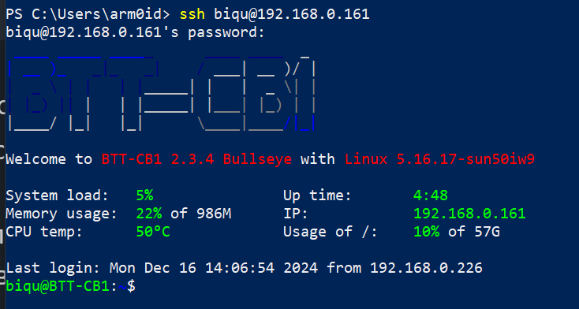
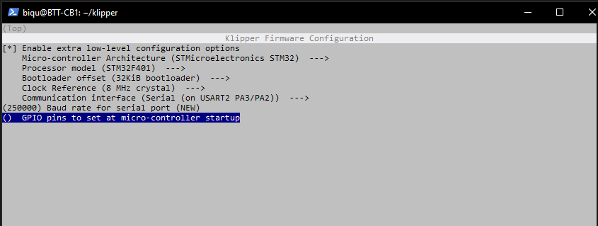
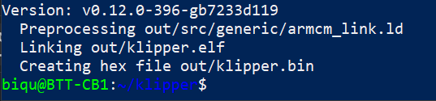
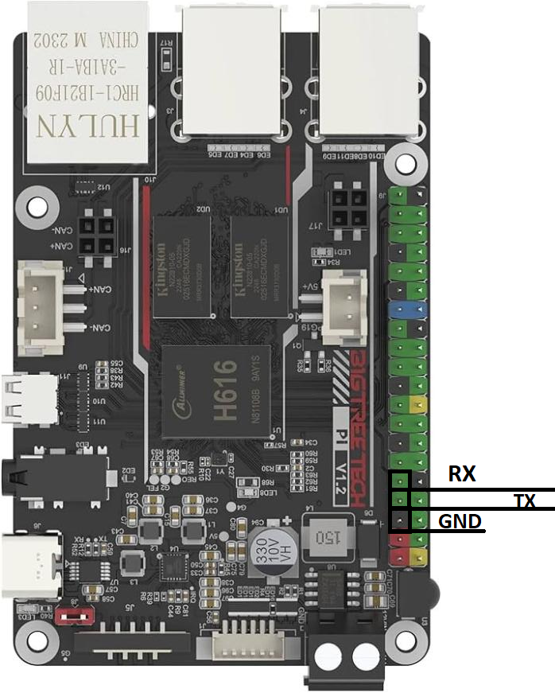
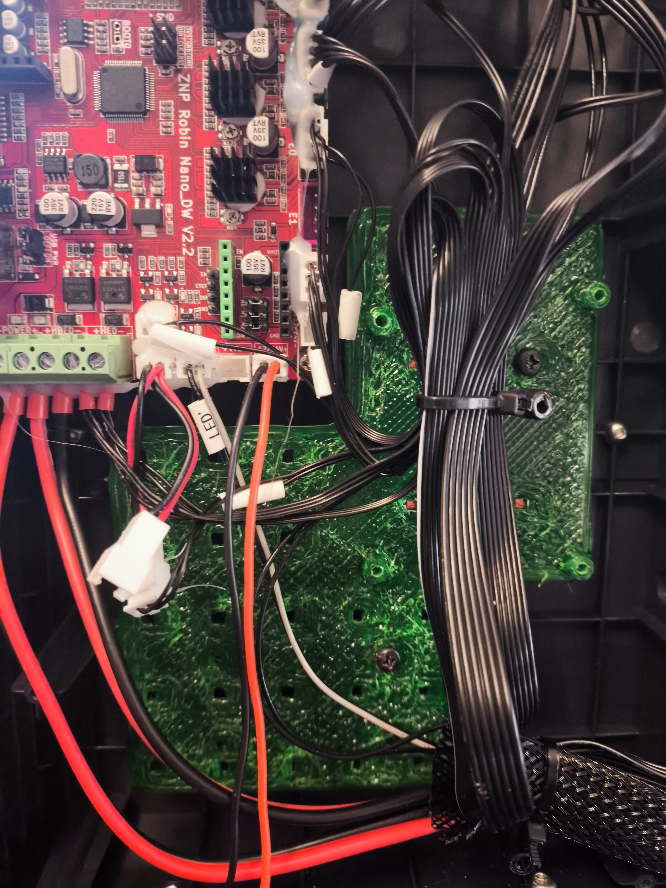
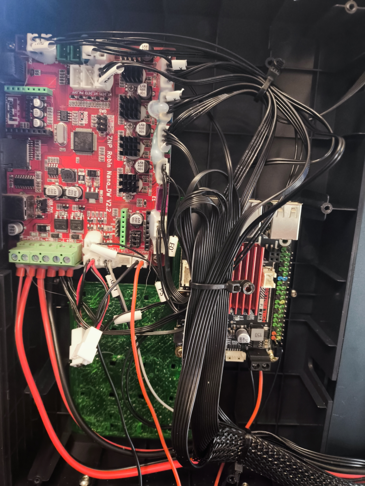

# Klipper_to_Elegoo_Neptune_UART_RU

## [Описание]
В данном репозитории я попробую подробно описать как скомпилировать прошивку и подключить 3D принтер **Elegoo Neptune 3 Pro** по протоколу *UART* (не используя USB кабель) в прошивке *Klipper*, которая установлена на одноплатник **BTT Pi**, а так же разместить железки в корпусе.
Рекомендую сначала прочитать до конца, чтобы сложилась общая картинка.
## [Содержание]
0. Предусловие
1. Сборка и Компиляция прошивки
2. Прошивка принтера
3. Подключение железок
4. Подстройка Klipper

## [Приступим]
### 0. Предусловие
Инструкция рассчитана на то, что Вы уже установили **Klipper** на свой одноплатный компьютер и загрузили конфигурационный файл(***printer.cfg***) для своего принтера.
Если же нет, то найти инструкцию можно [тут](https://github.com/Konstant-3d/Neptune3pro-klipper/wiki/%D0%9F%D1%80%D0%BE%D1%81%D1%82%D0%BE%D0%B9-%D0%B3%D0%B0%D0%B9%D0%B4-%D0%BF%D0%BE-%D1%83%D1%81%D1%82%D0%B0%D0%BD%D0%BE%D0%B2%D0%BA%D0%B5-%D0%BA%D0%BB%D0%B8%D0%BF%D0%BF%D0%B5%D1%80%D0%B0-%D0%BD%D0%B0-Neptune-3-Pro-%D0%B8-Bigtreetech-btt-pi-v1.2), но на этапе прошивки принтера можно остановиться и вернуться сюда.
Эту инструкция также подойдет для другого одноплатника, нужно будет гуглить *pinout*. 
#### *Мой конфиг*:
* Принтер Neptune 3Pro
* Одноплатник BTT Pi
#### *Вам понадобится*:
* *СД*-карта для прошивки принтера
* Соединительные провода:
	* F-M 3штуки 10-15см
		/*либо, если вы умеете паять*
	* 3 штыревые вилки и F-F 3 штуки 10-15 см | вилку придется впаять в разъем j17(далее подробнее).
* *SSH*-клиент(например *Putty*, но я буду пользоваться *PowerShell*)

### 1. Сборка и компиляция прошивки

#### 1.1 Подключаемся к BTT Pi по SSH 
Я буду использовать *PowerShell*, поэтому после открытия пишу команду:
```bash
ssh biqu@192.168.0.161
```
*где:* 
* `biqu` - имя стандартного пользователя в *BTT-CB1*,
* `192.168.0.161` - адрес одноплатника в локальной сети.

Далее он запросит пароль, который тоже `biqu` - и мы подключились, будет выведен некий логотип платы/ОС.


#### 1.2 Собираем прошивку под UART в BIN-арник
Теперь нас ждет этап сборки/компиляции прошивки, который будет исполнять сам *linux* - это нужно, чтобы у нас не было потом ошибки `mcu protol error`, которая высвечивается на главной странице, когда версии *Klipper*-а и *mcu*(платы принтера) не совпадают.
  1. Перейдем в каталог `klipper`:
```bash
cd klipper
```
  2. Очистим каталог от предыдущих компиляций, если такие были:
```bash
make clean
```
  3. Запустим конфигуратор прошивки:
```bash
make menuconfig
```
  4. Настроим конфигуратор:
		Разные версии Klipper-а будут слегка отличаться, но основные пункты останутся:

> [ * ]Enable extre low-level configuration options
> Micro-controller Architecture (STMicroelectronics STM32)
> Processor model (STM32F401)
> Bootloader offset (32Kib bootloader)
> Clock Reference (8 MHz crystal)
> Communication interface (Serial (on USART2 PA3/PA2))
> (250000) Baud rate for serial port
> () GPIO pins to set at micro-controller startup



  5. Сохраним и соберем прошивку
	* После того, как Вы настроили *конфигуратор* нужно будет выйти, сохранив изменения: нажимаем `Q` и `Y`.
	* Чтобы преобразовать это в BIN-арник для принтера нужно будет вписать в консоль:
```bash
 make
```

*Если вы увидели такое сообщение, то можно продолжать. Версия может быть другой.*
> Кстати, если убрать галочку с самого первого пункта в конфигураторе, то make преобразует в klipper.uf2 файл - который можно скормить любому rasberry бутлоадеру.

  6. Закроем SSH подключение:
```bash
exit
```
### 2. Прошивка принтера 
Для прошивки принтера нужно, чтобы вывод утилиты *make*, а именно *klipper.bin* оказался на СД-карте и в принтере:
1. Скачаем прошивку на ПК:
```bash
scp biqu@192.168.0.161:~/klipper/out/klipper.bin e:\prog\klipper_n3pro
```
*где:*
* *scp* - утилита для безопасного копирования данных между Linux-системами по протоколу *SSH*,
* *biqu* - стандартное имя пользователя *BTT-CB1*,
* *192.168.0.161* - локальный адрес одноплатника,
* *~/klipper/out/klipper.bin* - стандартный адрес, куда сохраняет *make*,
* *e:\prog\klipper_n3pro* - путь на моем ПК, куда я скачал прошивку.

2. Подготовка СД-карты
	1. Прежде чем копировать *BIN*-арник на карту памяти нужно его переименовать, иначе принтер проигнорирует его: `ZNP_ROBIN_NANO.bin`,
	2. Форматируем СД-карту в формат *FAT32*,
	3. Копируем `ZNP_ROBIN_NANO.bin` в корень карты.

3. Прошивка принтера
	1. Выключаем питания принтера,
	2. Вставляем СД-карту в соответствующий разъем на принтере,
	3. Включаем принтер,
	4. Ждем в районе 5-10 минут,
	5. Выключаем питание и проверяем переименовался ли файл на СД-карте на `ZNP_ROBIN_NANO.CUR` - это сигнализирует о том, что принтер успешно прошился.

### 3. Подключаем принтер к одноплатнику по UART
На моей *BTT Pi* есть гребенка GPIO разъемов:

И на принтере разъем *J17*:
![[Pasted image 20241218021542.png]]
А соединять нужно по принципу:

| Пины Robin Nano | Пины GPIO BTT Pi |
| --------------- | ---------------- |
| *TX*            | *RX*             |
| *RX*            | *TX*             |
| *GND*           | *GND*            |

*я специально обвел контакты с разъема под ESP-модуль, чтобы можно было легко подключить соединительным проводом F-M(мама-папа) от Ардуино*

У меня получилось вот так:
![[BTTpi_connect_to_n3pro.jpg]]

Чтобы смонтировать внутри корпуса нужно:
1. заранее распечатать два файлика из папки `models`:
	* Stands - 3 штуки
	* base - 1 штука
![[Pasted image 20241218022447.png]]

2. Запастись 6 винтами и терпением, чтобы смонтировать пластину внутри корпуса:


Штырьки нужны, чтобы закрепить переходную пластину на пересечениях ребер жесткости в пластике корпуса.
После монтажа всех компонентов можно закрутить крышку, а Wi-Fi антенну приклеить на балку вне корпуса.
* Питание для одноплатника я также взял с платы принтера - правый нижний разъем с маркировкой `-24V/+24V`.
### 4. Подстройка принтера
#### Шаг первый
В самом интерфейсе Klipper нужно перейти в конфигурацию принтера - `printer.cfg` и заменить эту часть кода:
```cfg
[mcu]
serial: /dev/ttyUSB0
```
На:
```
[mcu]
serial: /dev/ttyS0
```
Сохранить и перезагрузить.
#### Шаг второй
Подключаемся по *SSH* к одноплатнику, как указано в п 1.1 и пишем команду:
```bash
sudo nano /boot/BoardEnv.txt
```
Открывается редактор текста, где нужно будет найти строку:
```BoardEnv.txt
console=display
```
и заменить ее на:
```BoardEnv.txt
console=serial
```
Затем нужно сохранить, выйти и перезагрузить:
1. Нажимаем `Ctrl` + `O`,
2. Нажимаем `Enter` - чтобы подтвердить,
3. Нажимаем `Ctrl` + `X` - чтобы выйти из редактора,
4. Пишем `reboot` - чтобы перезагрузить одноплатник.

